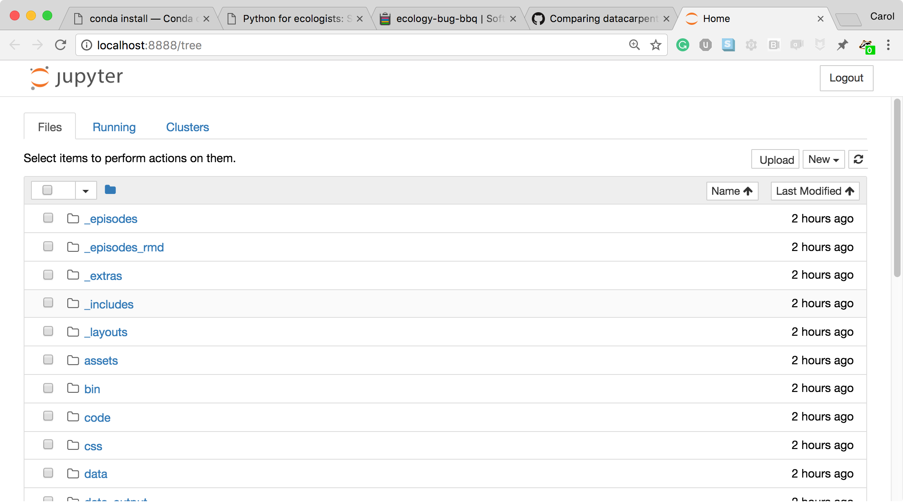
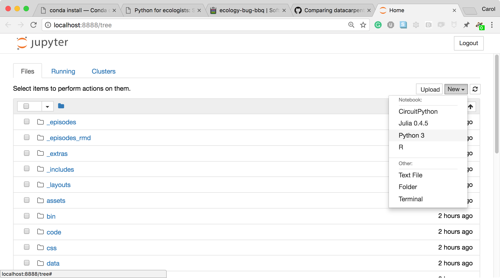
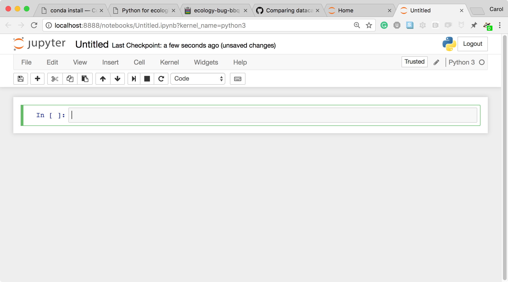
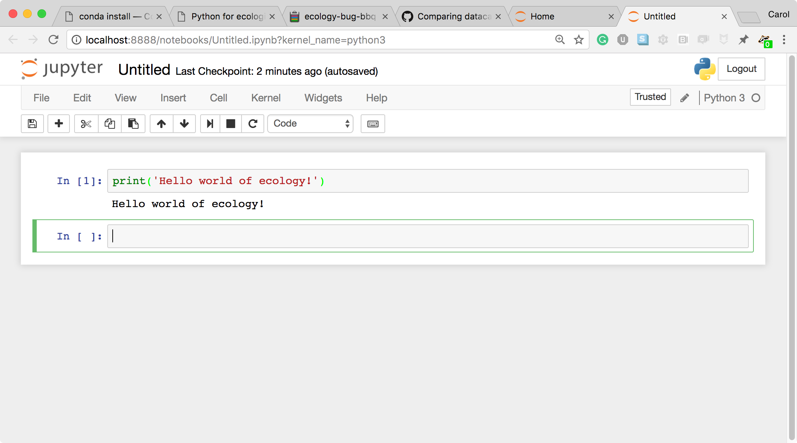
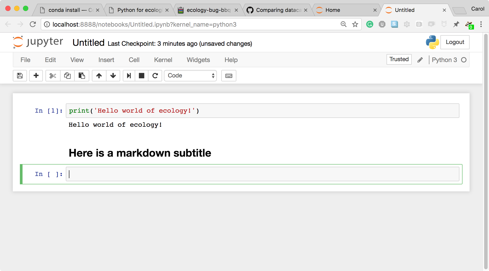

*Captura de pantalla de un [Jupyter Notebook sobre mecánica cuántica](https://github.com/jrjohansson/qutip-lectures) por Robert Johansson*

### Como funcionan los __Jupyter notebooks__

Al escribir el comando `jupyter notebook`, ocurre lo siguiente:

* Un servidor de __Jupyter Notebook__ es creado en tu máquina local.
* El servidor de  __Jupyter Notebook__ solo se ejecuta en tu máquina local
  y no utiliza una conexión a internet.
* El servidor de __Jupyter Notebook__ abre el cliente de __Jupyter Notebook__, 
  también conocido como la interfaz de usuario de notebook, en tu navegador web
  predeterminado.

  
  *El navegador de archivos de __Jupyter notebook__*

* Para crear un nuevo __notebook__ de Python selecciona __"New"__ del manu 
  desplegable de la esquina superior derecha de la pantalla.

  
  *El navegador de archivos de __Jupyter notebook__*

* Cuando creas un nuevo __notebook__ y escribes código en tu navegador, el 
  navegador web y el servidor de __Jupyter Notebook__ se comunican entre si.

  
  *Un nuevo __Jupyter notebook__ en blanco*

* Bajo el menu __"help"__, puedes tomar un rápido tour interactivo sobre como 
  utilizar el __notebook__. Más ayuda sobre __Jupyter__ y recursos de 
  paquetes clave se encuentran aquí también. 

  
  *Tour de interfaz del usuario y Ayuda*

* El servidor de __Jupyter Notebook__ hace el trabajo y los cálculos, y el navegador 
  web procesa el __notebook__.
* El navegador web entonces te muestra el __notebook__ actualizado.

* Por ejemplo, haz clic en la primera celda y escribe algo de código en Python.

  
  *Una celda de código*

* Esta es una celda de **Código** (nota el tipo de celda en el menú desplegable con la palabra **Code**).
  Para ejecutar la celda, presiona <kbd>Shift</kbd>+<kbd>Return</kbd>.

  
  *Una celda de código y su resultado*

* Veamos una celda de **Markdown**. __Markdown__ es un lenguaje de manipulación de 
  texto que es legible pero que ofrece formato adicional. No olvides 
  seleccionar **Markdown** del menú desplegable de tipo de celda. Haz clic 
  en la celda y escribe texto en __Markdown__.

  
  *Una celda de __Markdown__*

* Para ejecutar una celda, presiona <kbd>Shift</kbd>+<kbd>Return</kbd>.

  
  *Una celda de __Markdown__ ejecutada*

Este flujo de trabajo tiene varias ventajas:

- Puedes escribir, editar, copiar y pegar bloques de código fácilmente.
- El autocompletado facilita el accesso a los nombres de las cosas que estas usando
  y te permite aprender más de ellas.
- Te permite anotar tu código con enlaces, texto de diferentes tamaños,
  viñetas, etc. para hacer la información más accesible para ti y tus
  colaboradores.
- Te permite mostrar gráficos junto al código que los produce para contar
  la historia completa de tu análisis.

### Como se guarda el __notebook__

* El archivo __notebook__ se guarda en un formato llamado JSON y tiene el 
  sufijo `.ipynb`.
* Igual que HTML para una página web, lo que se guarda en un archivo __notebook__
  se ve diferente a lo que tu vez en tu navegador.
* Pero este formato le permite a __Jupyter__ mezclar software (en muchos lenguajes)
  con documentación y gráficos, todo en un archivo.

### Modos del __Notebook__: __Control__ y __Edit__

El __notebook__ tiene dos modos de operación: __Control__ y __Edit__. El modo
__Control__ te permite editar funciones a nivel __notebook__; mientras, el modo
__Edit__ te permite cambiar los contenidos de las celdas del __notebook__.
Recuerda que un __notebook__ esta compuesto de un numero de celdas que contienen
código, __markdown__, html, visualizaciones, y más.

### Ayuda y más información

Utiliza el menú **Help** y sus opciones options cuando lo necesites.
