## Nota

Python tiene muy buenos recursos para crear gráficos incorporados en el paquete `matplotlib`, pero para éste episodio, utilizaremos el paquete [`plotnine`] (https://plotnine.readthedocs.io/en/stable/), que facilita la creación de gráficos informativos usando datos estructurados. El paquete `plotnine` está basado en la implementación R de [`ggplot2`](http://ggplot2.org/) y [La gramática de gráficos](http://link.springer.com/book/10.1007%2F0-387-28695-0)
por Leland Wilkinson. Además el paquete [`plotnine`](https://plotnine.readthedocs.io/en/stable/) está construido sobre `matplotlib` e interactúa bien con `Pandas`.

Al igual que con los otros paquetes, `plotnine` necesita ser importado. Es bueno
practicar usando una abreviatura como usamos `pd` para `Pandas`:

~~~
%matplotlib inline
import plotnine as p9
~~~
{: .language-python }

Desde ahora todas las funciones de `plotnine` se pueden acceder usando `p9.` por delante.

Para los ejercicios usaremos los datos de `surveys.csv` descartando los valores
 `NA`.

~~~
import pandas as pd

surveys_complete = pd.read_csv('data/surveys.csv')
surveys_complete = surveys_complete.dropna()
~~~
{: .language-python}

# Creando gráficos con plotnine

El paquete `plotnine` (es parte de [La gramática de gráficos] (http://link.springer.com/book/10.1007%2F0-387-28695-0)) se usa para la creación de gráficos complejos a partir de los datos en un `DataFrame`. Utiliza configuraciones por defecto que ayudan a crear gráficos con calidad de publicación con unos pocos ajustes.

Los gráficos `plotnine` se construyen paso a paso agregando nuevos elementos uno
encima del otro usando el operador `+`. Poniendo cada paso entre paréntesis `()` proporciona una sintaxis compatible con Python.

Para construir un gráfico `plotnine` necesitamos:

- Conectar el gráfico a un `DataFrame` específico usando el argumento `data`:

~~~
(p9.ggplot(data=surveys_complete))
~~~
{: .language-python}

Como no hemos definido nada más, sólo se presenta un marco vacío para el gráfico.

- Define las opciones del gráfico usando `mapping` y estéticas `aes`, para **seleccionar las variables** que quieres mostrar en el gráfico, y definir la presentación de estas variables, como tamaño, color, forma, etc. Las ésteticas más importantes son: `x`,` y`, `alpha`,` color` o `colour`, `fill`,` linetype`, `shape`,` size` y `stroke`.

~~~
(p9.ggplot(data=surveys_complete,
           mapping=p9.aes(x='weight', y='hindfoot_length')))
~~~
{: .language-python}

- Todavía no tenemos un gráfico, primero tenemos que definir qué tipo de geometría
utilizar. Puedes interpretar ésto como: las variables que se usan en el gráfico son las que serán
modificadas por objetos o geometrías. Lo más sencillo es probablemente usar puntos.
`geom_point` es una de las opciones de geometría `geoms`, que define la representación gráfica de los datos.
Otras geometrías son `geom_line`, `geom_bar`, etc. Para agregar un `geom` al gráfico usa el símbolo `+`:

~~~
(p9.ggplot(data=surveys_complete,
           mapping=p9.aes(x='weight', y='hindfoot_length'))
    + p9.geom_point()
)
~~~
{: .language-python}

El símbolo `+` en el paquete `plotnine` es particularmente útil porque te permite
modificar los objetos `plotnine` existentes. Esto significa que puedes configurar fácilmente el gráfico con *plantillas* y explorar convenientemente diferentes tipos de gráficos. El gráfico anterior también se puede generar con código como este:

~~~
# Crea un marco para el gráfico definiendo las variables
surveys_plot = p9.ggplot(data=surveys_complete,
                         mapping=p9.aes(x='weight', y='hindfoot_length'))

# Dibuja los puntos en el marco
surveys_plot + p9.geom_point()
~~~
{: .language-python}

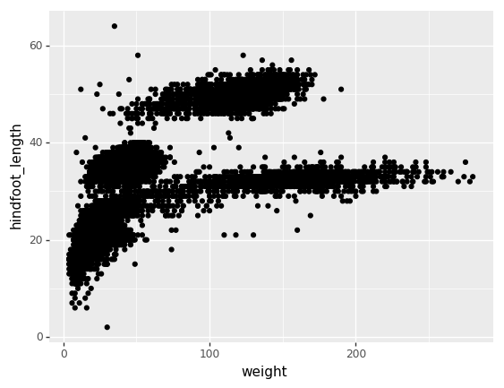

> ## Desafío - gráfico de barras
> Trabajando con los datos de `survey_complete`, usa la columna `plot-id` para
> crear un gráfico de barras `geom_bar` que cuente el número de registros  para cada parcela. (Mira la documentación de la geometría de barras para manejar los conteos).
>
> > ## Respuestas
> >
> > ~~~
> > (p9.ggplot(data=surveys_complete,
> >            mapping=p9.aes(x='plot_id'))
> >     + p9.geom_bar()
> > )
> > ~~~
> > {: .language-python}
> >
> > 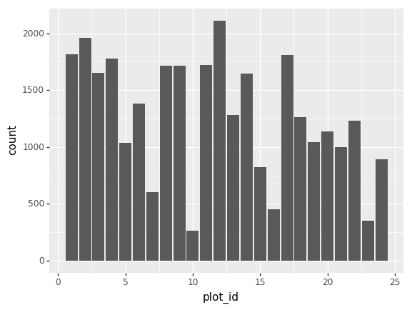
> {: .solution}
{: .challenge}

Notas:

- Cualquier ajuste en la función `ggplot()` se visualiza en las capas del gráfico
(por ejemplo, las configuraciones universales). Esto incluye los ejes `x` y `y`
 que configuraste en las capa de estéticas `aes()`.
- También puedes especificar estéticas individuales para cada `geom` independientemente de las estéticas definidas globalmente en la función `ggplot()`.

# Construyendo tus gráficos de forma iterativa

La construcción de gráficos con `plotnine` es típicamente un proceso iterativo. Empezamos definiendo el conjunto de datos que usaremos, colocaremos los ejes y elegiremos una geometría. Por lo tanto, los elementos mínimos de cualquier gráfico son `data`,` aes` y `geom-*`:

~~~
(p9.ggplot(data=surveys_complete,
           mapping=p9.aes(x='weight', y='hindfoot_length'))
    + p9.geom_point()
)
~~~
{: .language-python}

Luego, comenzamos a modificar este gráfico para extraer más información. Por
ejemplo, podemos agregar transparencia (`alfa`) para evitar la obstrucción visual
por aglomeración de puntos:

~~~
(p9.ggplot(data=surveys_complete,
           mapping=p9.aes(x='weight', y='hindfoot_length'))
    + p9.geom_point(alpha=0.1)
)
~~~
{: .language-python}

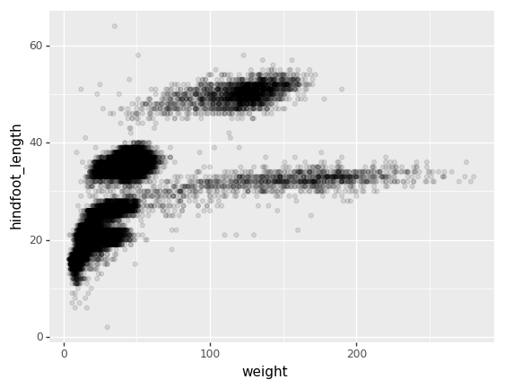

¡También puedes agregar color a los puntos!

~~~
(p9.ggplot(data=surveys_complete,
           mapping=p9.aes(x='weight', y='hindfoot_length'))
    + p9.geom_point(alpha=0.1, color='blue')
)
~~~
{: .language-python}

Si quieres usar un color diferente para cada especie, tienes que conectar la
columna `species_id` con la estética del color:

~~~
(p9.ggplot(data=surveys_complete,
           mapping=p9.aes(x='weight',
                          y='hindfoot_length',
                          color='species_id'))
    + p9.geom_point(alpha=0.1)
)
~~~
{: .language-python}

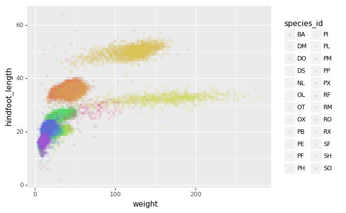

Aparte de las configuraciones en los argumentos `data`, `aes`
y los elementos `geom-*`, también se pueden agregar elementos adicionales,
usando el signo `+`:

- Cambiando las etiquetas:

~~~
(p9.ggplot(data=surveys_complete,
           mapping=p9.aes(x='weight', y='hindfoot_length', color='species_id'))
    + p9.geom_point(alpha=0.1)
    + p9.xlab("Weight (g)")
)
~~~
{: .language-python}

- Puedes también cambiar las escalas para colores, ejes.... Por ejemplo,
una versión del gráfico anterior usando el logarítmo de los números en el eje x
podría ayudar a una mejor interpretación de los números más pequeños:

~~~
(p9.ggplot(data=surveys_complete,
           mapping=p9.aes(x='weight', y='hindfoot_length', color='species_id'))
    + p9.geom_point(alpha=0.1)
    + p9.xlab("Weight (g)")
    + p9.scale_x_log10()
)
~~~
{: .language-python}

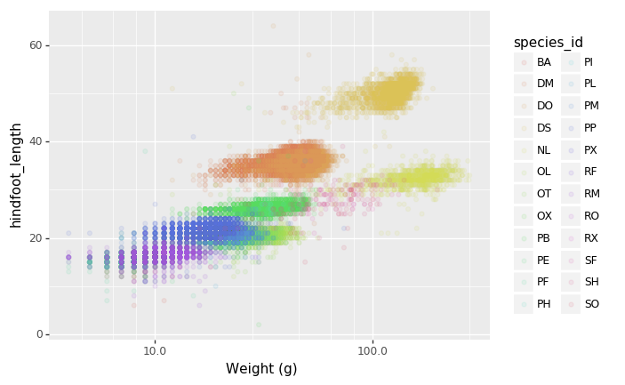

- También puedes escoger un tema (`theme_*`) o algunos elementos específicos del tema (`theme`).
Por lo general, los gráficos con fondo blanco parecen más legibles cuando se imprimen. Entonces, podemos configurar el fondo a blanco usando la función `theme_bw()` y cambiar el tamaño del texto con `theme()`.

~~~
(p9.ggplot(data=surveys_complete,
           mapping=p9.aes(x='weight', y='hindfoot_length', color='species_id'))
    + p9.geom_point(alpha=0.1)
    + p9.xlab("Weight (g)")
    + p9.scale_x_log10()
    + p9.theme_bw()
    + p9.theme(text=p9.element_text(size=16))
)
~~~
{: .language-python}

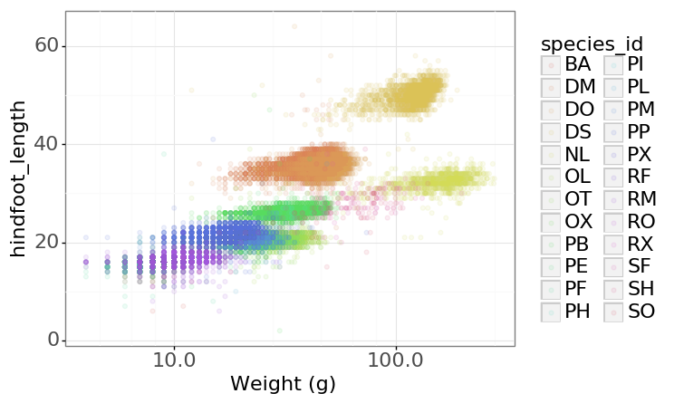

> ## Desafío - retocando un gráfico de barras
> Usa el código del ejercicio anterior y cambia la estética de color por la
> variable `sex`, también cambia la geometría para tener un gráfico de barras,
> finalmente, cambia la escala `scale` del color de relleno para que tengas una barra
> azul y una naranja usando `blue` y `orange` (mira este link en inglés de la referencia [API reference plotnine](https://plotnine.readthedocs.io/en/stable/api.html#Color-and-fill-scales) para encontrar la función que necesitas).
>
> > ## Respuestas
> >
> > ~~~
> > (p9.ggplot(data=surveys_complete,
> >            mapping=p9.aes(x='plot_id',
> >                           fill='sex'))
> >     + p9.geom_bar()
> >     + p9.scale_fill_manual(["blue", "orange"])
> > )
> > ~~~
> > {: .language-python}
> > 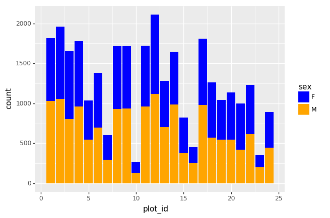
> {: .solution}
{: .challenge}

# Gráficos de distribuciones

Visualizar una distribución de datos es una tarea común en el análisis y exploración de los datos.
Por ejemplo, para visualizar la distribución de datos de la columna `weight` por cada especie `species_id`, puedes usar una gráfica de caja:

~~~
(p9.ggplot(data=surveys_complete,
           mapping=p9.aes(x='species_id',
                          y='weight'))
    + p9.geom_boxplot()
)
~~~
{: .language-python}

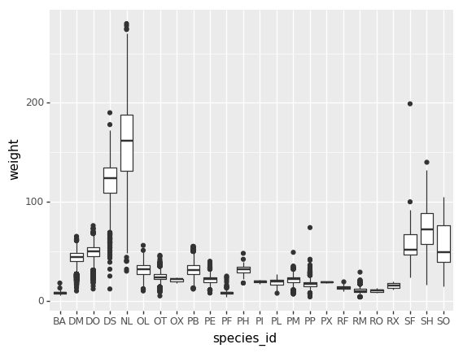

Agregando los puntos a la gráfica de caja nos dá una mejor idea de la distribución de las observaciones:

~~~
(p9.ggplot(data=surveys_complete,
           mapping=p9.aes(x='species_id',
                          y='weight'))
    + p9.geom_jitter(alpha=0.2)
    + p9.geom_boxplot(alpha=0.)
)
~~~
{: .language-python}

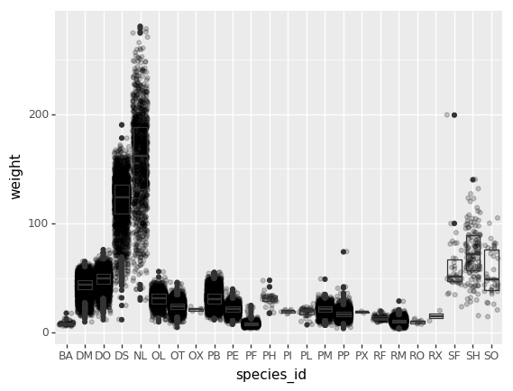

> ## Desafío - distribuciones
>
> Los gráficos de caja son resúmenes útiles, pero ocultan la *forma* de la distribución.
> Por ejemplo, si hay una distribución bimodal, esto no se observaría
> con un gráfico de caja. Una alternativa al gráfico de caja es el gráfico de violín, donde se dibuja la forma (de la densidad de los puntos).
>
> Al visualizar datos, es importante considerar la *escala* de la
> observaciones. Por ejemplo, puede valer la pena cambiar la escala del eje para
> distribuir mejor las observaciones en el espacio.
>
> - Reemplaza el gráfico de caja con uno de violín, mira `geom_violin()`
> - Transforma la columna `weight` a la escala log10, mira `scale_y_log10()`
> - Agrega color a los puntos en tu gráfico de acuerdo a la parcela donde
> la muestra fue tomada (`plot_id`).
>
> Sugerencia: Primero comprueba la clase de `plot_id`. Si usas `factor()` dentro de la estética `aes`, `plotnine` manejará los valores como valores categóricos.
>
> > ## Respuestas
> >
> > ~~~
> > (p9.ggplot(data=surveys_complete,
> >            mapping=p9.aes(x='species_id',
> >                           y='weight',
> >                           color='factor(plot_id)'))
> >     + p9.geom_jitter(alpha=0.3)
> >     + p9.geom_violin(alpha=0, color="0.7")
> >     + p9.scale_y_log10()
> > )
> > ~~~
> > {: .language-python}
> > 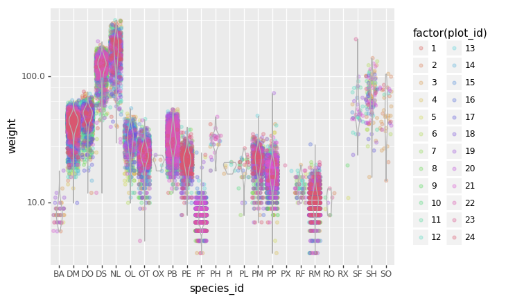
> {: .solution}
{: .challenge}

# Gráficos de series

Calculemos el número de cada tipo de especie por año. Para esto primero tenemos que agrupar las especies (`species_id`) por cada año `year`.

~~~
yearly_counts = surveys_complete.groupby(['year', 'species_id'])['species_id'].count()
yearly_counts
~~~
{: .language-python}

Cuando revisamos los resultados del cálculo anterior, vemos que `year` y `species_id` son índices de filas. Podemos cambiar este indice para que sean usados como una variable de columnas:

~~~
yearly_counts = yearly_counts.reset_index(name='counts')
yearly_counts
~~~
{: .language-python}

Los gráficos de series se pueden visualizar usando líneas (`geom_line`) con años en el eje `x` y el conteo en el eje `y`.

~~~
(p9.ggplot(data=yearly_counts,
           mapping=p9.aes(x='year',
                          y='counts'))
    + p9.geom_line()
)
~~~
{: .language-python}

Desafortunadamente eso no funciona, porque nos muestra todas las especies juntas. Tenemos que especificar que queremos una línea para cada especie. Esto se modifica en la función de estética conectando el color con la variable `species_id`:

~~~
(p9.ggplot(data=yearly_counts,
           mapping=p9.aes(x='year',
                          y='counts',
                          color='species_id'))
    + p9.geom_line()
)
~~~
{: .language-python}

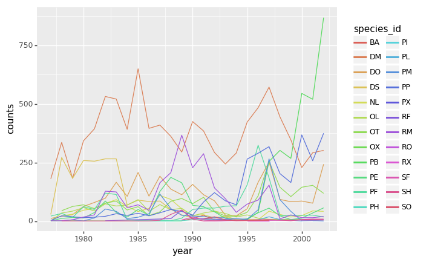

# Facetas

Como cualquier librería que maneje la gramática de gráficos, `plotnine` tiene
una técnica especial denominada *faceting* que permite dividir el gráfico en múltiples gráficos en función de una categoría incluida en el conjunto de datos.

¿Recuerdas el gráfico de puntos que creaste antes, usando `weight` y `hindfoot_length`?
~~~
(p9.ggplot(data=surveys_complete,
           mapping=p9.aes(x='weight',
                          y='hindfoot_length',
                          color='species_id'))
    + p9.geom_point(alpha=0.1)
)
~~~
{: .language-python}

Podemos reusar este mismo código y agregar una faceta con `facet_wrap` en base a una categoría para dividir el gráfico para cada uno de los grupos, por ejemplo, usando la variable `sex`:

~~~
(p9.ggplot(data=surveys_complete,
           mapping=p9.aes(x='weight',
                          y='hindfoot_length',
                          color='species_id'))
    + p9.geom_point(alpha=0.1)
    + p9.facet_wrap("sex")
)
~~~
{: .language-python}
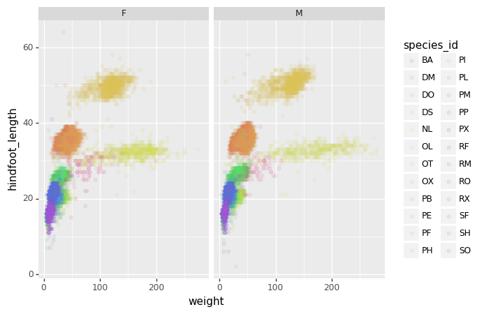

Ahora podemos aplicar el mismo concepto con cualquier categoría:

~~~
(p9.ggplot(data=surveys_complete,
           mapping=p9.aes(x='weight',
                          y='hindfoot_length',
                          color='species_id'))
    + p9.geom_point(alpha=0.1)
    + p9.facet_wrap("plot_id")
)
~~~
{: .language-python}

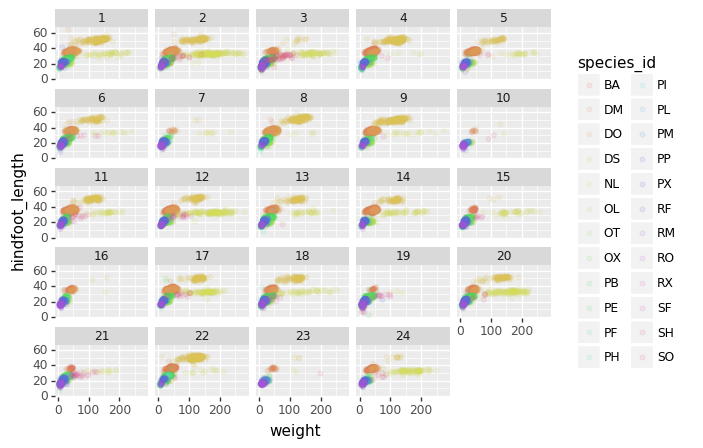

La capa de facetas `facet_wrap` divide los gráficos arbitrariamente para que
entren sin problemas en una hoja. Por otro lado si quieres definir explícitamente
la distribución de los gráficos usa `facet_grid` con una fórmula (`rows ~ columns`)
un punto `.` indica que es sólo una fila o una columna.

~~~
# Selecciona unos años que te interesen
survey_2000 = surveys_complete[surveys_complete["year"].isin([2000, 2001])]

(p9.ggplot(data=survey_2000,
           mapping=p9.aes(x='weight',
                          y='hindfoot_length',
                          color='species_id'))
    + p9.geom_point(alpha=0.1)
    + p9.facet_grid("year ~ sex")
)
~~~
{: .language-python}
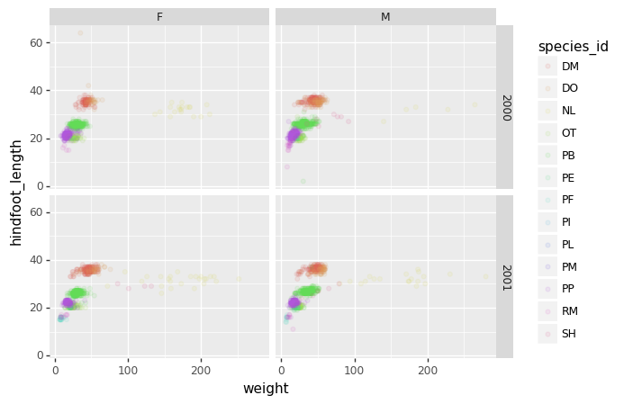

> ## Desafío - facetas 1
> Crea un gráfico separado por cada especie, que muestre como el peso medio de las especies cambia por año.
>
> > ## Respuestas
> >
> > yearly_weight = surveys_complete.groupby(['year', 'species_id'])['weight'].mean().reset_index()
> >
> > ~~~
> > (p9.ggplot(data=yearly_weight,
> >            mapping=p9.aes(x='year',
> >                           y='weight'))
> >     + p9.geom_line()
> >     + p9.facet_wrap("species_id")
> > )
> > ~~~
> > {: .language-python}
> {: .solution}
{: .challenge}

> ## Desafío - facetas 2
> Us ando el código del ejercicio anterior compara visualmente como los pesos de
> machos y hembras van cambiando en el tiempo. Crea un gráfico separado por cada `sex`
> que use un color diferente por cada especie `species_id`.
>
> > ## Respuestas
> > yearly_weight = surveys_complete.groupby(['year', 'species_id', 'sex'])['weight'].mean().reset_index()
> >
> > (p9.ggplot(data=yearly_weight,
> >            mapping=p9.aes(x='year',
> >                           y='weight',
> >                           color='species_id'))
> >     + p9.geom_line()
> >     + p9.facet_wrap("sex")
> > )
> > {: .language-python}
> {: .solution}
{: .challenge}

# Más retoques

Como la sintaxis de `plotnine` sigue la versión original del paquete de R `ggplot2`,
la documentación de `ggplot2` te dá mas información e inspiración para retocar tus gráficos. Mira la hoja resumen de `ggplot2` [cheat sheet](https://www.rstudio.com/wp-content/uploads/2015/08/ggplot2-cheatsheet.pdf), y piensa de que maneras puedes mejorar el gráfico.
Puedes escribir tus ideas y comentarios en el Etherpad.

Las opciones temáticas nos proveen una gran variedad de adaptaciones visuales. Usa el siguiente ejemplo de un gráfico de barras que presenta las observaciones por año.

~~~
(p9.ggplot(data=surveys_complete,
           mapping=p9.aes(x='factor(year)'))
    + p9.geom_bar()
)
~~~
{: .language-python}

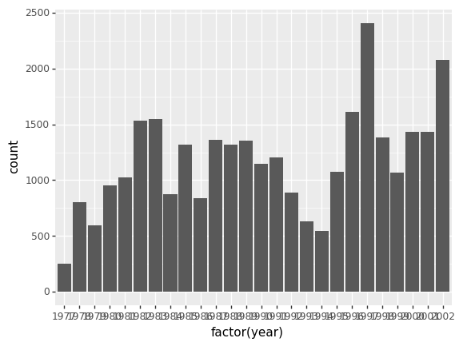

Aquí hemos usado el año `year` como una variable categórica usando la función
`factor`. Pero al hacer esto, las etiquetas de los años se sobreponen. Usando una opción `theme` podemos rotar las etiquetas en el eje x:

~~~
(p9.ggplot(data=surveys_complete,
           mapping=p9.aes(x='factor(year)'))
    + p9.geom_bar()
    + p9.theme_bw()
    + p9.theme(axis_text_x = p9.element_text(angle=90))
)
~~~
{: .language-python}

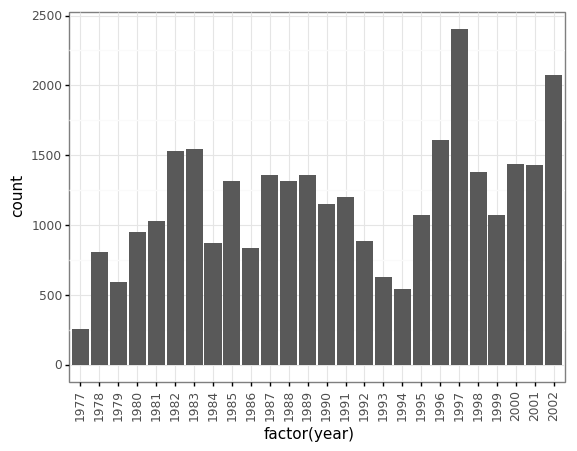

Cuando encuentres las opciones de visualización que te agraden y forman parte del tema, puedes guardar estas opciones en un objeto para luego reusarlo en los próximos gráficos que vayas a crear.

~~~
my_custom_theme = p9.theme(axis_text_x = p9.element_text(color='grey', size=10,
                                                         angle=90, hjust=.5),
                           axis_text_y = p9.element_text(color='grey', size=10))
(p9.ggplot(data=surveys_complete,
           mapping=p9.aes(x='factor(year)'))
    + p9.geom_bar()
    + my_custom_theme
)
~~~
{: .language-python}

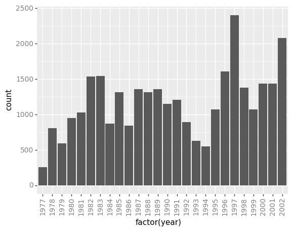

> ## Desafío - hecho a medida
Tómate otros cinco minutos para mejorar uno de los gráficos anteriores, o crea un nuevo gráfico hecho a medida, con los retoques que quieras.
>
> Aquí hay algunas ideas:
>
> * Intenta cambiar el grosor de las lineas en el gráfico de línea.
> * ¿Podrías cambiar la leyenda y sus etiquetas?
> * Usa una paleta de colores nueva (mira las opciones aquí http://www.cookbook-r.com/Graphs/Colors_(ggplot2)/)
{: .challenge}

Después de crear tu nuevo gráfico, puedes guardarlo en diferentes formatos. También puedes cambiar las dimensiones, la resolución usando `width`, `height` and `dpi`:

~~~
my_plot = (p9.ggplot(data=surveys_complete,
           mapping=p9.aes(x='weight', y='hindfoot_length'))
    + p9.geom_point()
)
my_plot.save("scatterplot.png", width=10, height=10, dpi=300)
~~~
{: .language-python}


