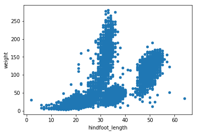
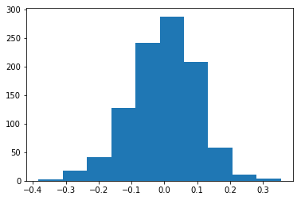
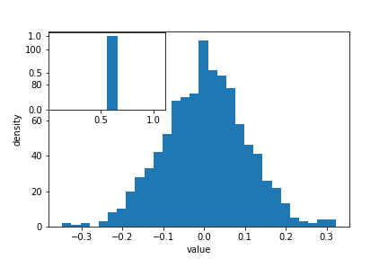

## Resumiendo

Hasta aquí, hemos repasado las tareas que se suelen llevar a cabo en el manejo y procesamiento de datos utilizando los archivos limpios que hemos proporcionado en el taller. En este ejercicio de repaso final, realizaremos muchas de las tareas que hemos visto pero con __datasets__ reales. Esta lección también incluye visualización de datos.

A diferencia de las anteriores, en esta lección no se dan instrucciones paso a paso para realizar cada una de las tareas. Usa los materiales de las lecciones que ya has estudiado, así como la documentación de Python.

## Obtener datos

Hay muchos repositorios en línea desde los cuales puedes obtener datos. Te proporcionamos un archivo de datos para usar con estos ejercicios, pero no dudes en utilizar cualquier conjunto de datos que encuentres relevante para tu investigación. El archivo [`bouldercreek_09_2013.txt`]({{ page.root }}/data/bouldercreek_09_2013.txt) contiene datos sobre vertidos de agua, resumidos en 15 intervalos de 15 minutos (en pies cúbicos por segundo) de una estación hidrométrica en Boulder Creek en North 75th Street (USGS gage06730200) durante el periodo 1-30 de Septiembre de 2013. Si deseas usar este __dataset__, lo encontrarás en la carpeta de datos.

## Limpia tus datos y ábrelos con Python y Pandas

Para empezar, importa tu archivo de datos a Python usando Pandas. ¿No te funcionó? Puede que tu archivo de datos tenga un  encabezado que Pandas no reconozca como parte de la tabla. Elimina este encabezado, ¡pero no lo hagas borrándolo en un editor de texto! Usa la terminal o Python para hacerlo; no quisieras tener que hacer esto a mano si tuvieras muchos archivos por procesar.

Si aún tienes problemas para importar los datos como una tabla con Pandas, consulta la documentación. Prueba a abrir la __docstring__ en un ipython notebook utilizando un signo de interrogación. Por ejemplo:

~~~
import pandas as pd
pd.read_csv?
~~~
{: .language-python}

Fíjate en los argumentos de la función para ver si hay un valor predeterminado que sea diferente al que requiere tu archivo (Sugerencia: probablemente el problema sea el delimitador o separador. Los delimitadores más comunes son `','` comas, `' '` espacios, y `'\t'` tabulaciones).

Crea un __DataFrame__ que incluya sólo los valores de los datos que te sean útiles. En nuestro archivo de ejemplo de la estación hidrométrica, esos valores podrían ser la fecha, la hora y las mediciones de descarga o vertido. Convierte cualquier medida de unidades imperiales a unidades SI. También puedes cambiar el nombre de las columnas en el __DataFrame__ del siguiente modo:

~~~
df = pd.DataFrame({'1stcolumn':[100,200], '2ndcolumn':[10,20]}) # esto crea un __DataFrame__ para el ejemplo!
print('With the old column names:\n') # El \n crea una nueva línea, para que sea más fácil de ver
print(df)

df.columns = ['FirstColumn','SecondColumn'] # renombra las columna!
print('\n\nWith the new column names:\n')
print(df)
~~~
{: .language-python}

~~~
Con los nombres antiguos de las columnas:

   1stcolumn  2ndcolumn
0        100         10
1        200         20

Con los nuevos nombres de columna:

   FirstColumn  SecondColumn
0          100            10
1          200            20
~~~
{: .output}

## El paquete Matplotlib

[Matplotlib](https://matplotlib.org/) es un paquete de Python usado ampliamente por la comunidad científica de Python para crear gráficos de alta calidad, listos para publicar. Admite una amplia gama de formatos de gráficos rasterizados y vectoriales, tales como PNG, PostScript, EPS, PDF y SVG.

Además, Matplotlib es el motor que hay detrás de las capacidades gráficas de los paquetes Pandas y plotnine. Por ejemplo, cuando invocamos el método `.plot` en objetos de datos Pandas, de hecho estamos usando el paquete matplotlib.

Primero, importamos la caja de herramientas pyplot:

~~~
import matplotlib.pyplot as plt
~~~
{: .language-python}

Ahora leemos los datos y los representarlos en un gráfico!

~~~
surveys = pd.read_csv("data/surveys.csv")
my_plot = surveys.plot("hindfoot_length", "weight", kind="scatter")
plt.show() # no necesariamente en Jupyter Notebooks
~~~
{: .language-python}

> ## Sugerencia
> Por defecto, matplotlib crea una figura en una ventana separada. Cuando usamos Jupyter notebooks, podemos hacer que las figuras aparezcan en línea dentro del cuaderno; lo hacemos ejecutando:
>
> ~~~
> %matplotlib inline
> ~~~
> {: .language-python}
{: .callout}

El objeto que obtenemos es un objeto matplotlib (puedes verificarlo tu mismo con `type(my_plot)`),
al que podemos ajustarle y realizarle mejoras adicionales utilizando otros métodos de matplotlib.

> ## Sugerencia
> Matplotlib en sí mismo puede resultar algo abrumador, por lo que una estrategia útil de entrada es hacer todo lo posible en capas de conveniencia, _p.e._ empezar creando los gráficos en Pandas o plotnine y luego usar matplotlib para el resto.
{: .callout}

En esta lección cubriremos algunos comandos básicos para crear y formatear gráficos con matplotlib. Un gran recurso para ayudarnos a crear y agregar estilo a nuestras figuras es la galería matplotlib (<http://matplotlib.org/gallery.html>), la cual incluye gráficos en todo tipo de estilos junto con el código fuente para crearlos.

### `plt` pyplot vs matplotlib basado en objetos

Matplotlib se integra bien con el paquete NumPy y permite usar __arrays__ de NumPy como entrada para las funciones para crear gráficos disponibles. Considera los siguientes datos de ejemplo, creados con NumPy extrayendo 1000 muestras de una distribución normal con un valor medio de 0 y una desviación estándar de 0.1:

~~~
import numpy
sample_data = numpy.random.normal(0, 0.1, 1000)

~~~
{: .language-python}

Para representar un histograma de la distribución normal, podemos usar la función `hist` directamente:

~~~
plt.hist(sample_data)
~~~
{: .language-python}

> ## Sugerencia: Visualization multiplataforma de Figuras
> Los __Jupyter Notebooks__ nos simplifican muchos aspectos de nuestro análisis y de las visualizaciones. Por ejemplo, hacen buena parte del trabajo de visualización por nosotros. Pero quizás no todos tus colaboradores trabajan con __Jupyter Notebooks__. El comando `.show()` te permite visualizar los gráficos tanto si trabajas en la línea de comandos, con un __script__ o en el intérprete de IPython. En el ejemplo anterior, si añades `plt.show()` después de crear el gráfico, eso permitirá que tus colegas que no estén usando __Jupyter notebooks__ puedan reproducir igualmente tu trabajo en su plataforma.
{: .callout}

o creas primero los objetos `figure` y `axis` de matplotlib y luego agregas un histograma con 30 contenedores de datos:

~~~
fig, ax = plt.subplots()  # initiate an empty figure and axis matplotlib object
ax.hist(sample_data, 30)
~~~
{: .language-python}

Aunque el último enfoque requiere un poco más de código para crear la misma trama, la ventaja es que nos da control total sobre el gráfico y podemos agregarle nuevos elementos tales como etiquetas, una cuadrícula, títulos u otros elementos visuales. Por ejemplo, podemos agregar ejes adicionales a la figura y personalizar sus etiquetas:

~~~
fig, ax1 = plt.subplots() # preparar un gráfico con matplotlib
ax1.hist(sample_data, 30)

# Crear el gráfico de una distribución Beta
a = 5
b = 10
beta_draws = np.random.beta(a, b)
# editar las etiquetas
ax1.set_ylabel('density')
ax1.set_xlabel('value')

# añadir ejes adicionales a la figura
ax2 = fig.add_axes([0.125, 0.575, 0.3, 0.3])
#ax2 = fig.add_axes([left, bottom, right, top])
ax2.hist(beta_draws)
~~~
{: .language-python}

> ## Reto - Dibujo a partir de distribuciones
> Echa un vistazo a la documentación aleatoria deNumPy <https://docs.scipy.org/doc/numpy-1.14.0/reference/routines.random.html>.
> Toma una distribución con la que no tengas ninguna familiaridad e intenta muestrearla y visualizarla.
{: .challenge}

### Enlaza matplotlib, Pandas y plotnine

Cuando creamos un gráfico usando pandas o plotnine, ambas bibliotecas usan matplotlib para crear esas. The plots created in pandas or plotnine are matplotlib
objects, which enables us to use some of the advanced plotting options available
in the matplotlib library. Because the objects output by pandas and plotnine
can be read by matplotlib, we have many more options than any one library can
provide, offering a consistent environment to make publication-quality visualizations.

~~~
fig, ax1 = plt.subplots() # prepara un gráfico de matplotlib

surveys.plot("hindfoot_length", "weight", kind="scatter", ax=ax1)

# realiza ajustes al gráfico con matplotlib:
ax1.set_xlabel("Hindfoot length")
ax1.tick_params(labelsize=16, pad=8)
fig.suptitle('Scatter plot of weight versus hindfoot length', fontsize=15)
~~~
{: .language-python}

Para recuperar una figura de matplotlib de plotnine para luego ajustarla, usa la función `draw()` en plotnine:

~~~
import plotnine as p9
myplot = (p9.ggplot(data=surveys,
                    mapping=p9.aes(x='hindfoot_length', y='weight')) +
              p9.geom_point())

# convierte el output de plotnine a un objeto de matplotlib
my_plt_version = myplot.draw()

# Realiza más ajustes al gráfico con matplotlib:
p9_ax = my_plt_version.axes[0] # cada subgráfico es un ítem en una lista
p9_ax.set_xlabel("Hindfoot length")
p9_ax.tick_params(labelsize=16, pad=8)
p9_ax.set_title('Scatter plot of weight versus hindfoot length', fontsize=15)
plt.show() # esto no es necesario en Jupyter Notebooks
~~~
{: .language-python}

> ## Reto - Pandas y matplotlib
> Carga el conjunto de datos de streamgage con Pandas, haz un subconjunto filtrando la semana de la inundación de Front Range en 2013 (del 11 al 15 de septiembre) y crea un hidrograma (gráfico de líneas) usando Pandas, vinculándolo a un objeto de maptlotlib `ax` vacío . Crea un segundo eje que muestre el conjunto de datos entero. Adapta el título y las etiquetas de los ejes usando matplotlib.
>
> > ## Respuestas
> >
> > ~~~
> > discharge = pd.read_csv("data/bouldercreek_09_2013.txt",
> >                         skiprows=27, delimiter="\t",
> >                         names=["agency", "site_id", "datetime",
> >                                "timezone", "discharge", "discharge_cd"])
> > discharge["datetime"] = pd.to_datetime(discharge["datetime"])
> > front_range = discharge[(discharge["datetime"] >= "2013-09-09") &
> >                         (discharge["datetime"] < "2013-09-15")]
> >
> > fig, ax = plt.subplots()
> > front_range.plot(x ="datetime", y="discharge", ax=ax)
> > ax.set_xlabel("") # no label
> > ax.set_ylabel("Discharge, cubic feet per second")
> > ax.set_title(" Front Range flood event 2013")
> > discharge = pd.read_csv("../data/bouldercreek_09_2013.txt",
> >                       skiprows=27, delimiter="\t",
> >                       names=["agency", "site_id", "datetime",
> >                              "timezone", "flow_rate", "height"])
> > fig, ax = plt.subplots()
> > flood = discharge[(discharge["datetime"] >= "2013-09-11") &
                        (discharge["datetime"] < "2013-09-15")]
>>
> > ax2 = fig.add_axes([0.65, 0.575, 0.25, 0.3])
>> flood.plot(x ="datetime", y="flow_rate", ax=ax)
> > discharge.plot(x ="datetime", y="flow_rate", ax=ax2)
> > ax2.legend().set_visible(False)

> > ax.set_xlabel("") # no label
> > ax.set_ylabel("Discharge, cubic feet per second")
> > ax.legend().set_visible(False)
> > ax.set_title(" Front Range flood event 2013")
> > ~~~
> > {: .language-python}
> >
> > 
> {: .solution}
{: .challenge}

### Guardar figuras de matplotlib

Una vez que estés satisfecho con el gráfico resultante, puedes guardar el gráfico con el método `.savefig(*args)` de matplotlib:

~~~
fig.savefig("my_plot_name.png")
~~~
{: .language-python}

Lo cual guardará la `fig` creada usando Pandas / matplotlib como un archivo png con nombre `my_plot_name`

> ~~~
>     Matplotlib reconoce la extensión usada en el nombre del archivo y soporta (en la mayoría de computadoras) los formatos png, pdf, ps, eps y svg.
> ~~~
{: .callout}

> ## Reto - Guardar figuras a un archivo
> Repasa la documentación del método `savefig` y comprueba cómo cumplir con los requerimientos de las revistas que aceptan archivos en `pdf` con dpi >= 300.
>
> > ## Respuestas
> >
> > ~~~
> > fig.savefig("my_plot_name.pdf", dpi=300)
> > ~~~
> > {: .language-python}
> {: .solution}
{: .challenge}

## Crea otros tipos de gráficos:

Matplotlib permite crear muchos otros tipos de gráficos del mismo modo como hace gráficos de líneas bidimensionales. Mira los ejemplos en <http://matplotlib.org/users/screenshots.html> e intenta realizar alguno de ellos (Haz click en el enlace
"Source code" y haz copy y paste en una nueva celda en ipython notebook o
bien guárdalo como un archivo de texto con extensión `.py` y ejecútalo en la línea de comandos).

> ## Reto - Gráfico final
> Muestra tus datos usando uno o más gráficos de entre los mostrados en la galería de ejemplos. Las que elijas dependerán del contenido de tu propio archivo de datos. Si está usando el archivo [`bouldercreek_09_2013.txt`]({{ page.root }}/data/bouldercreek_09_2013.txt), podrías por ejemplo, hacer un histograma de la cantidad de días con un vertido medio determinado, usar gráficos de barras para mostrar estadísticas de vertido diarias o explorar las diferentes formas en que matplotlib puede manejar fechas y horas.
{: .challenge}



